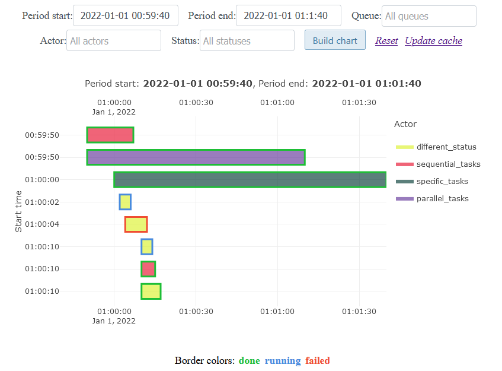

.. http://docutils.sourceforge.net/docs/user/rst/quickref.html

django_dramatiq_charts 📊
=========================

Draw charts by `django_dramatiq <https://github.com/Bogdanp/django_dramatiq>`_ task history in db.

Chart types: `load <#load-chart>`_ and `timeline <#timeline-chart>`_.

.. image:: https://img.shields.io/pypi/dm/django_dramatiq_charts.svg?style=social

===============  ===============================================================
Python version   3.6+
License          Apache-2.0
PyPI             https://pypi.python.org/pypi/django_dramatiq_charts/
===============  ===============================================================

.. contents::

Installation
------------
::

    $ pip install django-dramatiq-charts

Requirements:

* Django 2.2+
* dramatiq 1.11+
* django-dramatiq 0.10.0+

Guide
-----

Configuration
^^^^^^^^^^^^^

1. Add django_dramatiq_charts to installed apps after django_dramatiq app:

.. code-block:: python

    INSTALLED_APPS = [
        'django_dramatiq',
        'django_dramatiq_charts',
        'my_app',
        # ...
    ]

2. Add lib views to your urls:

.. code-block:: python

    from django_dramatiq_charts.views import load_chart, timeline_chart, clean_cache

    path('django_dramatiq_charts/load_chart/', load_chart, name='ddc_load_chart'),
    path('django_dramatiq_charts/timeline_chart/', timeline_chart, name='ddc_timeline_chart'),
    path('django_dramatiq_charts/clean_cache/', clean_cache, name='ddc_clean_cache'),

3. Configure lib parameters in your project settings file:

.. list-table::
   :header-rows: 1

   * - Parameter
     - Description
     - Default
   * - DJANGO_DRAMATIQ_CHARTS_PERM_FN
     - users with access to the charts
     - def fn(request): return request.user.is_superuser
   * - DJANGO_DRAMATIQ_CHARTS_LOAD_QS_FILTER
     - Custom queryset for load chart
     - None
   * - DJANGO_DRAMATIQ_CHARTS_TIMELINE_QS_FILTER
     - Custom queryset for timeline chart
     - None
   * - DJANGO_DRAMATIQ_CHARTS_CACHE_FORM_DATA_SEC
     - Minutes to cache choices of queue and actor form fields  (False-like to disable)
     - 4 hours

Load chart
^^^^^^^^^^

**Shows the number of simultaneously executed actors in each time interval on timeline**

.. image:: docs/load_chart.png

Tasks running more than one day are not counted (assumed to be an error).

Timeline chart
^^^^^^^^^^^^^^

**Shows actors on timeline**

If the task duration is less than a second, this task is displayed on the chart with a duration of 1 second.

Release notes
-------------

History of important changes: `release_notes.rst <https://github.com/ikvk/django_dramatiq_charts/blob/master/docs/release_notes.rst>`_

Thanks
------

Thanks to all who helped develop this library:

`MilkyCake <https://github.com/MilkyCake>`_,
`flaticon.com <https://www.flaticon.com/free-icons/bar-chart>`_
