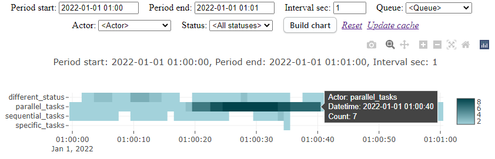
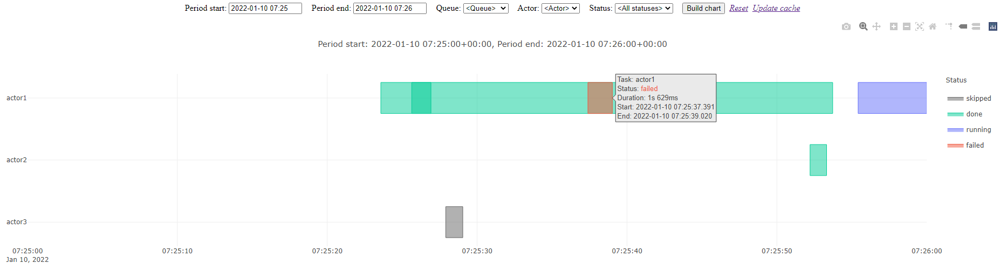
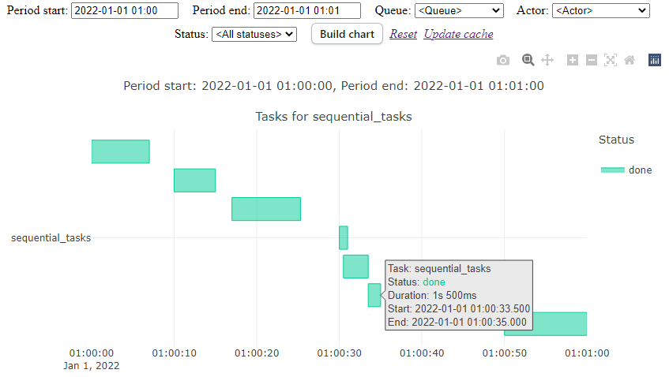

.. http://docutils.sourceforge.net/docs/user/rst/quickref.html

django_dramatiq_charts 📊
=========================

Draw charts by `django_dramatiq <https://github.com/Bogdanp/django_dramatiq>`_ task history.

Chart types: `load <#load-chart>`_ and `timeline <#timeline-chart>`_.

.. image:: https://img.shields.io/pypi/dm/django_dramatiq_charts.svg?style=social

===============  ===============================================================
Python version   3.6+
License          Apache-2.0
PyPI             https://pypi.python.org/pypi/django_dramatiq_charts/
===============  ===============================================================

.. contents::

Installation
------------
::

    $ pip install django-dramatiq-charts

Requirements:

* Django 1.11+
* dramatiq 0.18+
* django-dramatiq 0.10.0+

Guide
-----

Configuration
^^^^^^^^^^^^^

* Add views functions *load_chart*, *timeline_chart* to your urls.

* Configure lib parameters in your project settings file:

.. list-table::
   :header-rows: 1

   * - DJANGO_DRAMATIQ_CHARTS_PERM_FN
     - users with access to the charts
     - def fn(request): return request.user.is_superuser
   * - DJANGO_DRAMATIQ_CHARTS_PLOTLY_LIB
     - Link to Plotly.js lib
     - 'https://cdn.plot.ly/plotly-2.8.3.min.js'
   * - DJANGO_DRAMATIQ_CHARTS_LOAD_CHART_QS
     - Custom queryset for load chart
     - None
   * - DJANGO_DRAMATIQ_CHARTS_TIMELINE_CHART_QS
     - Custom queryset for timeline chart
     - None
   * - DJANGO_DRAMATIQ_CHARTS_CACHE_FORM_DATA_MIN
     - Minutes to cache choices of queue and actor form fields  (False-like to disable)
     - 720

Load chart
^^^^^^^^^^

Shows the number of simultaneously executed actors in each time interval

Tasks running more than one day are not counted (assumed to be an error).

Timeline chart
^^^^^^^^^^^^^^

1. Tasks grouped by actor name.

2. Click on the group to see all the actors of the group. Esc or double click for go back.

If the task duration is less than a second, this task is depicted on the chart with a duration of 1 second.

Release notes
-------------

History of important changes: `release_notes.rst <https://github.com/ikvk/django_dramatiq_charts/blob/master/docs/release_notes.rst>`_

Thanks
------

Big thanks to people who helped develop this library:

`MilkyCake <https://github.com/MilkyCake>`_
